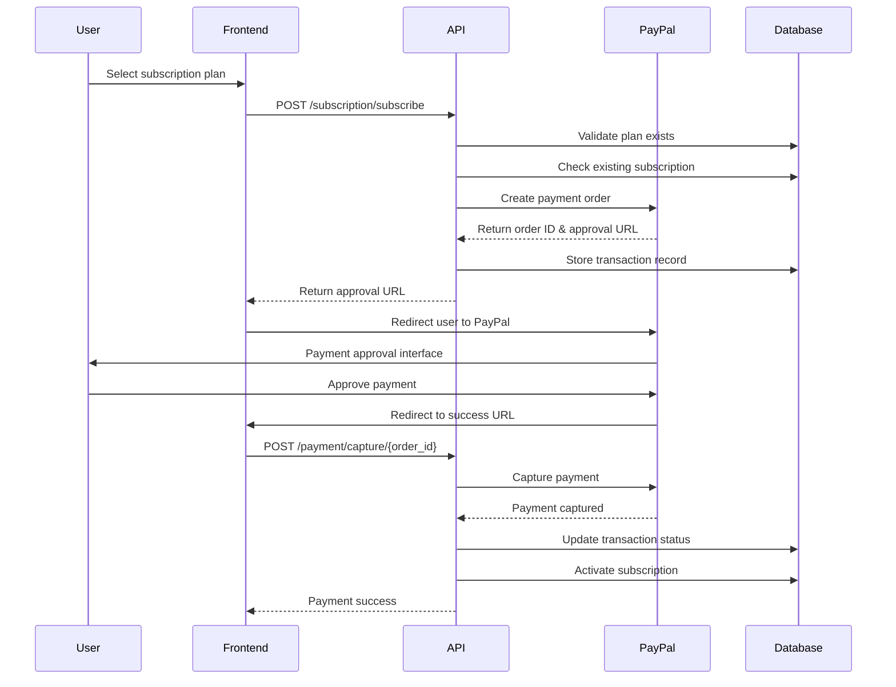
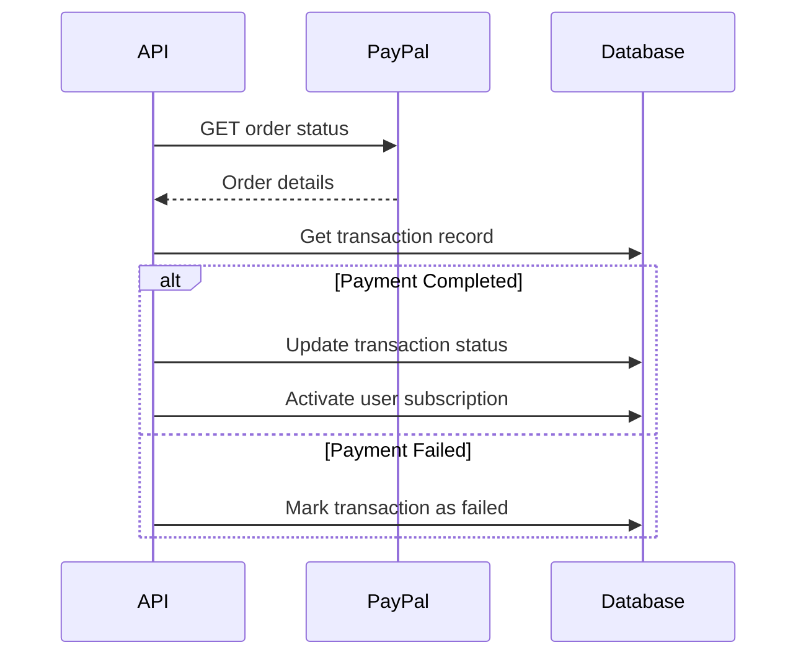

# PayPal Payment System Integration Documentation

## Table of Contents
1. [Overview](#overview)
2. [Architecture](#architecture)
3. [Database Schema](#database-schema)
4. [API Endpoints](#api-endpoints)
5. [Payment Flow](#payment-flow)
6. [Configuration](#configuration)
7. [Error Handling](#error-handling)
8. [Security](#security)
9. [Testing](#testing)
10. [Deployment](#deployment)

## Overview

The ESAL Platform integrates with PayPal's REST API to handle subscription payments for various service tiers. The system supports:

- Multiple subscription plans with different pricing tiers
- Secure payment processing using PayPal's sandbox and production environments
- Automatic subscription activation upon successful payment
- Payment verification and webhook handling
- Comprehensive transaction logging and audit trails
- Payment history tracking for users and administrators

## Architecture

### Components
- **PayPal Service** (`paypal_service.py`): Core payment processing logic
- **Subscription Manager** (`subscription_manager.py`): Subscription lifecycle management
- **Subscription Router** (`subscription.py`): FastAPI endpoints for payment operations
- **Database Layer**: PostgreSQL with Supabase for data persistence

### Technology Stack
- **Payment Gateway**: PayPal REST API v2
- **Backend**: FastAPI (Python)
- **Database**: PostgreSQL with Supabase
- **Authentication**: JWT-based user authentication
- **Environment**: Sandbox (development) and Production modes

## Database Schema

### Core Tables

#### 1. Subscription Plans (`subscription_plans`)
```sql
CREATE TABLE subscription_plans (
    id BIGSERIAL PRIMARY KEY,
    name VARCHAR(100) NOT NULL UNIQUE,
    description TEXT,
    price_kes DECIMAL(10,2) NOT NULL,
    price_usd DECIMAL(10,2) NOT NULL,
    duration_days INTEGER NOT NULL,
    features JSONB DEFAULT '{}',
    is_active BOOLEAN DEFAULT true,
    display_order INTEGER DEFAULT 0,
    created_at TIMESTAMPTZ DEFAULT NOW(),
    updated_at TIMESTAMPTZ DEFAULT NOW()
);
```

#### 2. Payment Transactions (`payment_transactions`)
```sql
CREATE TABLE payment_transactions (
    id BIGSERIAL PRIMARY KEY,
    user_id UUID NOT NULL REFERENCES auth.users(id),
    plan_id BIGINT NOT NULL REFERENCES subscription_plans(id),
    subscription_id BIGINT NULL,
    
    -- PayPal-specific fields
    paypal_order_id VARCHAR(100) NULL,
    paypal_status VARCHAR(50) NULL,
    approval_url TEXT NULL,
    
    -- Payment details
    amount_usd DECIMAL(10,2) NOT NULL,
    currency VARCHAR(3) NOT NULL DEFAULT 'USD',
    status VARCHAR(20) NOT NULL DEFAULT 'pending',
    payment_method VARCHAR(50) DEFAULT 'PayPal',
    
    -- Timestamps
    created_at TIMESTAMPTZ DEFAULT NOW(),
    updated_at TIMESTAMPTZ DEFAULT NOW(),
    completed_at TIMESTAMPTZ NULL
);
```

#### 3. User Subscriptions (`user_subscriptions`)
```sql
CREATE TABLE user_subscriptions (
    id BIGSERIAL PRIMARY KEY,
    user_id UUID NOT NULL REFERENCES auth.users(id),
    plan_id BIGINT NOT NULL REFERENCES subscription_plans(id),
    status VARCHAR(20) NOT NULL DEFAULT 'active',
    start_date TIMESTAMPTZ NOT NULL DEFAULT NOW(),
    end_date TIMESTAMPTZ NOT NULL,
    auto_renew BOOLEAN DEFAULT false,
    cancelled_at TIMESTAMPTZ NULL,
    created_at TIMESTAMPTZ DEFAULT NOW(),
    updated_at TIMESTAMPTZ DEFAULT NOW()
);
```

## API Endpoints

### Subscription Plans
- **GET** `/api/subscription/plans` - Get all available subscription plans
- **GET** `/api/subscription/plans/{plan_id}` - Get specific subscription plan

### User Subscriptions
- **GET** `/api/subscription/my-subscription` - Get current user's subscription
- **GET** `/api/subscription/usage` - Get usage statistics and limits

### Payment Operations
- **POST** `/api/subscription/subscribe` - Initiate new subscription payment
- **POST** `/api/subscription/upgrade` - Upgrade to higher-tier plan
- **POST** `/api/subscription/cancel` - Cancel current subscription

### Payment Verification
- **POST** `/api/subscription/payment/capture/{order_id}` - Capture approved payment
- **GET** `/api/subscription/payment/verify/{order_id}` - Verify payment status

### Payment History
- **GET** `/api/subscription/payment-history` - Get user's payment history

### Admin Endpoints
- **GET** `/api/subscription/admin/subscriptions` - Get all subscriptions (admin only)

## Payment Flow

### 1. Subscription Purchase Flow



### 2. Payment Verification Flow



## Configuration

### Environment Variables

```bash
# PayPal Configuration
PAYPAL_CLIENT_ID=your-paypal-client-id
PAYPAL_CLIENT_SECRET=your-paypal-client-secret
PAYPAL_SANDBOX=true  # false for production
PAYPAL_BASE_URL=https://api-m.sandbox.paypal.com  # Production: https://api-m.paypal.com

# Database Configuration
SUPABASE_URL=your-supabase-url
SUPABASE_ANON_KEY=your-supabase-anon-key
SUPABASE_SERVICE_ROLE_KEY=your-supabase-service-role-key

# Application Configuration
SITE_URL=http://localhost:3001
```

### PayPal Service Configuration

The `PayPalService` class automatically configures URLs based on the sandbox mode:

```python
class PayPalService:
    def __init__(self):
        self.client_id = settings.PAYPAL_CLIENT_ID
        self.client_secret = settings.PAYPAL_CLIENT_SECRET
        self.sandbox_mode = settings.PAYPAL_SANDBOX
        
        if self.sandbox_mode:
            self.base_url = "https://api-m.sandbox.paypal.com"
            self.checkout_url = "https://www.sandbox.paypal.com/checkoutnow"
        else:
            self.base_url = "https://api-m.paypal.com"
            self.checkout_url = "https://www.paypal.com/checkoutnow"
```

## PayPal Service Methods

### Core Methods

#### 1. `validate_credentials()`
Validates PayPal API credentials by attempting to get an access token.

```python
def validate_credentials(self) -> bool:
    """Validate PayPal API credentials"""
    try:
        access_token = self._get_access_token()
        return access_token is not None
    except Exception:
        return False
```

#### 2. `create_payment_request()`
Creates a PayPal payment order for subscription purchase.

```python
def create_payment_request(
    self, 
    user_id: str, 
    plan_id: int, 
    amount_usd: float,
    currency: str = "USD"
) -> Dict[str, Any]:
    """Create a PayPal payment request"""
```

**Parameters:**
- `user_id`: UUID of the user making the payment
- `plan_id`: ID of the subscription plan
- `amount_usd`: Payment amount in USD
- `currency`: Payment currency (default: USD)

**Returns:**
```python
{
    "success": True,
    "order_id": "paypal_order_id",
    "approval_url": "https://paypal.com/approval_url",
    "transaction_id": 123,
    "amount": 29.99,
    "currency": "USD",
    "status": "created",
    "message": "PayPal order created successfully"
}
```

#### 3. `capture_payment()`
Captures an approved PayPal payment.

```python
def capture_payment(self, order_id: str) -> Dict[str, Any]:
    """Capture a PayPal payment after user approval"""
```

#### 4. `verify_payment()`
Verifies the status of a PayPal payment order.

```python
def verify_payment(self, order_id: str) -> Dict[str, Any]:
    """Verify payment status"""
```

#### 5. `process_payment_callback()`
Processes payment completion and activates subscription.

```python
def process_payment_callback(
    self,
    order_id: str, 
    transaction_id: Optional[int] = None
) -> Dict[str, Any]:
    """Process payment callback after user completes payment"""
```

## Request/Response Models

### Payment Request
```python
class PaymentRequest(BaseModel):
    plan_id: int
    billing_address: Optional[dict] = None
    phone_number: Optional[str] = None
```

### Payment Response
```python
class PaymentResponse(BaseModel):
    success: bool
    order_id: str
    approval_url: str
    message: str
    transaction_id: int
    amount: float
    currency: str
    status: str
```

### Subscription Plan
```python
class SubscriptionPlan(BaseModel):
    id: int
    name: str
    price: float
    currency: str
    duration_months: int
    description: Optional[str] = None
    features: Optional[dict] = None
    is_active: bool
```

### User Subscription Response
```python
class UserSubscriptionResponse(BaseModel):
    id: int
    user_id: str
    plan: SubscriptionPlan
    status: str
    start_date: datetime
    end_date: Optional[datetime]
    created_at: datetime
    usage_this_month: Optional[dict] = None
```

## Error Handling

### Common Error Scenarios

1. **Invalid PayPal Credentials**
   - Status: 500 Internal Server Error
   - Message: "Invalid PayPal credentials"

2. **Plan Not Found**
   - Status: 404 Not Found
   - Message: "Subscription plan not found"

3. **Existing Active Subscription**
   - Status: 400 Bad Request
   - Message: "You already have an active subscription to this plan"

4. **Payment Capture Failed**
   - Status: 500 Internal Server Error
   - Message: "Failed to capture payment"

5. **Invalid Upgrade**
   - Status: 400 Bad Request
   - Message: "New plan must be higher tier than current plan"

### Error Response Format
```python
{
    "detail": "Error message description",
    "status_code": 400
}
```

## Security

### Authentication
- All endpoints require JWT authentication via `get_current_user` dependency
- User access is restricted to their own subscription data
- Admin endpoints require role-based access control

### Data Protection
- Sensitive PayPal credentials stored as environment variables
- Payment data encrypted in transit using HTTPS
- Database connections secured with Row Level Security (RLS)
- Payment transaction IDs are UUIDs to prevent enumeration attacks

### PCI Compliance
- No credit card data is stored on ESAL servers
- All payment processing handled by PayPal's secure infrastructure
- Only transaction references and status information stored locally

## Testing

### Development Setup
1. Create PayPal Developer Account
2. Set up sandbox application
3. Configure environment variables with sandbox credentials
4. Use PayPal's test credit card numbers for testing

### Test Scenarios
1. **Successful Payment Flow**
   - Create subscription order
   - Redirect to PayPal
   - Approve payment with test account
   - Verify payment capture
   - Confirm subscription activation

2. **Failed Payment Scenarios**
   - Insufficient funds
   - Cancelled by user
   - Expired payment session
   - Invalid payment method

3. **Subscription Management**
   - Plan upgrades
   - Subscription cancellation
   - Usage limit enforcement

### Test Credentials (Sandbox)
```
Test Buyer Account:
Email: buyer@example.com
Password: test123456

Test Credit Cards:
Visa: 4032035084672169
Mastercard: 5333254306123067
```

## Deployment

### Production Checklist
1. **PayPal Configuration**
   - [ ] Switch to production PayPal credentials
   - [ ] Update `PAYPAL_SANDBOX=false`
   - [ ] Configure production webhook URLs
   - [ ] Test with real PayPal account

2. **Security**
   - [ ] Enable HTTPS for all endpoints
   - [ ] Validate SSL certificates
   - [ ] Set up proper CORS policies
   - [ ] Configure rate limiting

3. **Database**
   - [ ] Run production migrations
   - [ ] Set up database backups
   - [ ] Configure monitoring and alerts
   - [ ] Test failover procedures

4. **Monitoring**
   - [ ] Set up payment transaction monitoring
   - [ ] Configure error alerting
   - [ ] Set up performance monitoring
   - [ ] Test webhook delivery

### Environment-Specific URLs
```python
# Development
PAYPAL_BASE_URL = "https://api-m.sandbox.paypal.com"
SITE_URL = "http://localhost:3001"

# Production
PAYPAL_BASE_URL = "https://api-m.paypal.com"
SITE_URL = "https://your-production-domain.com"
```

## Troubleshooting

### Common Issues

1. **PayPal Access Token Errors**
   - Verify client ID and secret
   - Check network connectivity
   - Ensure proper base URL for environment

2. **Payment Capture Failures**
   - Verify order ID is valid
   - Check if payment was already captured
   - Ensure order hasn't expired

3. **Subscription Not Activated**
   - Check transaction status in database
   - Verify payment callback processing
   - Review error logs for exceptions

4. **Webhook Issues**
   - Verify webhook URL accessibility
   - Check webhook signature validation
   - Monitor webhook delivery logs

### Debug Commands
```python
# Validate PayPal credentials
paypal_service = PayPalService()
is_valid = paypal_service.validate_credentials()

# Check payment status
status = paypal_service.verify_payment(order_id)

# Get transaction details
transaction = paypal_service._get_payment_transaction_by_order_id(order_id)
```

### Logging
The system includes comprehensive logging at various levels:
- INFO: Successful operations
- WARNING: Recoverable errors
- ERROR: System errors requiring attention

Example log entries:
```
INFO: ✅ PayPal credentials validated successfully!
ERROR: ❌ Failed to validate PayPal credentials!
INFO: Payment ESAL-Premium-abc123 processed successfully via PayPal verification
WARNING: Payment order_123 verification failed: Invalid order ID
```

## API Usage Examples

### JavaScript/TypeScript (Frontend)
```javascript
// Initiate subscription payment
const response = await fetch('/api/subscription/subscribe', {
  method: 'POST',
  headers: {
    'Content-Type': 'application/json',
    'Authorization': `Bearer ${userToken}`
  },
  body: JSON.stringify({
    plan_id: 1,
    billing_address: {
      street: "123 Main St",
      city: "New York",
      state: "NY",
      zip: "10001"
    }
  })
});

const paymentData = await response.json();

// Redirect to PayPal for approval
if (paymentData.success) {
  window.location.href = paymentData.approval_url;
}

// Capture payment after user returns from PayPal
const captureResponse = await fetch(`/api/subscription/payment/capture/${orderId}`, {
  method: 'POST',
  headers: {
    'Authorization': `Bearer ${userToken}`
  }
});

const captureResult = await captureResponse.json();
```

### Python (Backend Integration)
```python
from app.services.paypal_service import PayPalService

# Initialize service
paypal_service = PayPalService()

# Create payment
payment_response = paypal_service.create_payment_request(
    user_id="user-uuid",
    plan_id=1,
    amount_usd=29.99,
    currency="USD"
)

# Capture payment
if payment_response["success"]:
    capture_result = paypal_service.capture_payment(
        payment_response["order_id"]
    )
```

## Conclusion

The PayPal payment system integration provides a robust, secure, and scalable solution for handling subscription payments in the ESAL Platform. The modular architecture allows for easy maintenance and future enhancements, while comprehensive error handling and logging ensure reliable operation in production environments.

For additional support or questions, refer to:
- PayPal Developer Documentation: https://developer.paypal.com/
- Supabase Documentation: https://supabase.com/docs
- FastAPI Documentation: https://fastapi.tiangolo.com/
