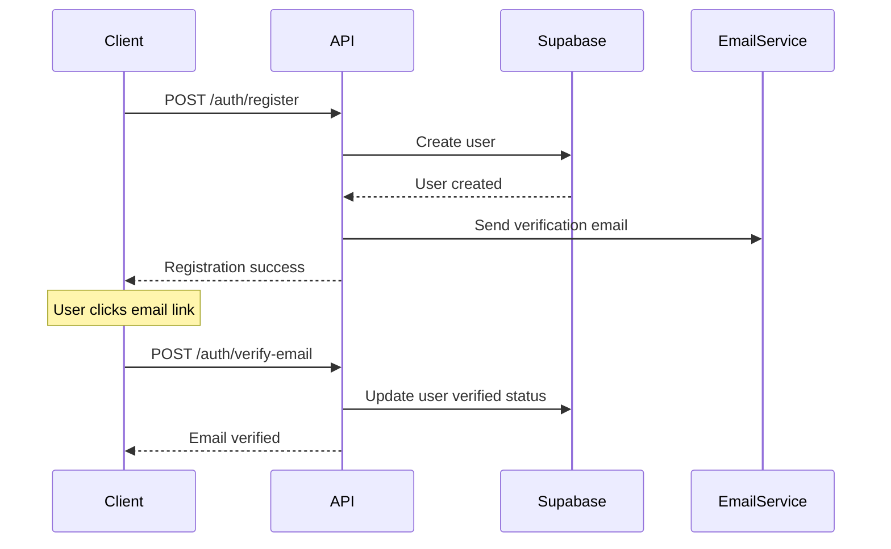
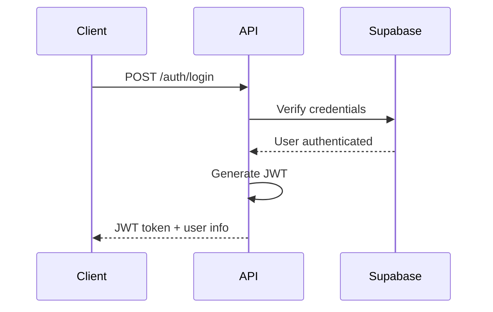
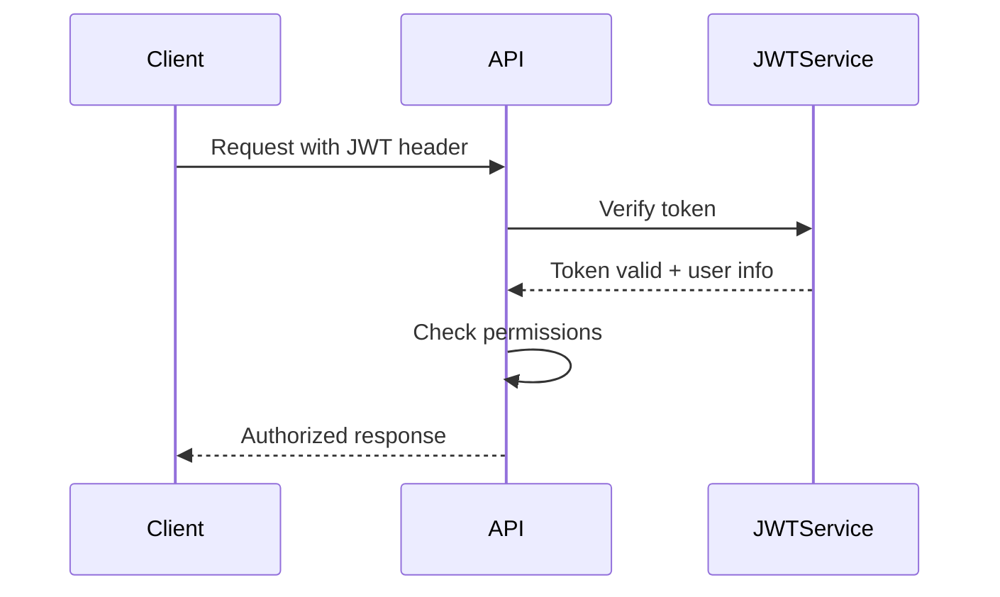

# ESAL Platform API Documentation

The ESAL Platform API is a RESTful API built with FastAPI that powers all the portals and provides comprehensive functionality for managing startups, investors, and innovation hubs.

## 🚀 Getting Started

### Base URL
```
Development: http://localhost:8000
Production: https://api.esalplatform.com
```

### API Version
Current version: `v1`
All endpoints are prefixed with `/api/v1`

### Authentication
The API uses JWT (JSON Web Tokens) for authentication.

```http
Authorization: Bearer <your-jwt-token>
```

## 📚 API Reference

### Authentication Endpoints

#### Register User
```http
POST /api/v1/auth/register
```

**Request Body:**
```json
{
  "email": "user@example.com",
  "full_name": "John Doe",
  "password": "securepassword123",
  "role": "innovator" // or "investor", "hub_admin"
}
```

**Response:**
```json
{
  "message": "User registered successfully",
  "user_id": "uuid-here",
  "email": "user@example.com",
  "role": "innovator"
}
```

#### Login
```http
POST /api/v1/auth/login
```

**Request Body:**
```json
{
  "email": "user@example.com",
  "password": "securepassword123"
}
```

**Response:**
```json
{
  "access_token": "jwt-token-here",
  "token_type": "bearer",
  "expires_in": 3600,
  "user_id": "uuid-here",
  "role": "innovator"
}
```

#### Refresh Token
```http
POST /api/v1/auth/refresh
```

#### Logout
```http
POST /api/v1/auth/logout
```

### User Management

#### Get Current User
```http
GET /api/v1/users/me
```

**Response:**
```json
{
  "id": "uuid-here",
  "email": "user@example.com",
  "full_name": "John Doe",
  "role": "innovator",
  "profile": {
    "bio": "Passionate entrepreneur",
    "location": "San Francisco, CA",
    "website": "https://johndoe.com",
    "linkedin": "https://linkedin.com/in/johndoe"
  },
  "created_at": "2025-06-06T12:00:00Z",
  "updated_at": "2025-06-06T12:00:00Z"
}
```

#### Update User Profile
```http
PUT /api/v1/users/me
```

**Request Body:**
```json
{
  "full_name": "John Doe",
  "profile": {
    "bio": "Updated bio",
    "location": "New York, NY",
    "website": "https://newwebsite.com"
  }
}
```

### Ideas Management

#### Submit New Idea
```http
POST /api/v1/ideas
```

**Request Body:**
```json
{
  "title": "Revolutionary AI Assistant",
  "description": "An AI assistant that helps with daily tasks",
  "industry": "Technology",
  "stage": "concept",
  "funding_needed": "500000",
  "problem_statement": "People need help managing daily tasks",
  "solution": "AI-powered personal assistant",
  "target_market": "Busy professionals",
  "business_model": "Subscription-based SaaS"
}
```

**Response:**
```json
{
  "id": "uuid-here",
  "title": "Revolutionary AI Assistant",
  "status": "submitted",
  "ai_score": 8.5,
  "created_at": "2025-06-06T12:00:00Z"
}
```

#### Get User Ideas
```http
GET /api/v1/ideas
```

**Query Parameters:**
- `status`: Filter by status (submitted, approved, rejected)
- `limit`: Number of results (default: 20)
- `offset`: Pagination offset (default: 0)

#### Get Idea Details
```http
GET /api/v1/ideas/{idea_id}
```

#### Update Idea
```http
PUT /api/v1/ideas/{idea_id}
```

### Investment Opportunities

#### Get Investment Opportunities
```http
GET /api/v1/opportunities
```

**Query Parameters:**
- `industry`: Filter by industry
- `stage`: Filter by stage
- `min_funding`: Minimum funding amount
- `max_funding`: Maximum funding amount
- `limit`: Number of results
- `offset`: Pagination offset

**Response:**
```json
{
  "opportunities": [
    {
      "id": "uuid-here",
      "startup_name": "TechCorp",
      "industry": "Technology",
      "stage": "seed",
      "seeking": "1000000",
      "valuation": "5000000",
      "pitch_summary": "Brief description",
      "ai_match_score": 9.2,
      "created_at": "2025-06-06T12:00:00Z"
    }
  ],
  "total": 25,
  "page": 1,
  "limit": 20
}
```

### Investor Dashboard

#### Get Dashboard Data
```http
GET /api/v1/investor/dashboard
```

**Response:**
```json
{
  "stats": {
    "portfolio_companies": 12,
    "total_investments": "5000000",
    "active_deals": 3,
    "successful_exits": 2,
    "roi_average": "25.5",
    "sectors_invested": ["Technology", "Healthcare", "Fintech"]
  }
}
```

#### Get Portfolio
```http
GET /api/v1/investor/portfolio
```

**Response:**
```json
{
  "portfolio": [
    {
      "id": "uuid-here",
      "company": "TechCorp",
      "investment_amount": "1000000",
      "investment_date": "2024-01-15",
      "current_valuation": "5000000",
      "status": "Growing",
      "industry": "Technology"
    }
  ],
  "total_invested": "5000000",
  "current_value": "8500000"
}
```

### AI Matching

#### Get AI Recommendations
```http
GET /api/v1/ai/recommendations
```

**Query Parameters:**
- `type`: recommendation type (startups, investors, opportunities)
- `limit`: Number of recommendations

#### Get AI Analysis
```http
POST /api/v1/ai/analyze
```

**Request Body:**
```json
{
  "type": "idea_analysis",
  "content": {
    "title": "AI Assistant",
    "description": "Detailed description...",
    "industry": "Technology"
  }
}
```

### Admin Endpoints

#### Get All Users
```http
GET /api/v1/admin/users
```

**Requires admin role**

#### Update User Status
```http
PUT /api/v1/admin/users/{user_id}/status
```

#### Get Platform Statistics
```http
GET /api/v1/admin/stats
```

## 🔒 Authentication Flow

### 1. Registration Flow


### 2. Login Flow


### 3. Protected Route Access


## 📊 Response Formats

### Success Response
```json
{
  "success": true,
  "data": {
    // Response data here
  },
  "message": "Operation completed successfully"
}
```

### Error Response
```json
{
  "success": false,
  "error": {
    "code": "VALIDATION_ERROR",
    "message": "Invalid input data",
    "details": [
      {
        "field": "email",
        "message": "Invalid email format"
      }
    ]
  }
}
```

### Pagination Response
```json
{
  "data": [...],
  "pagination": {
    "page": 1,
    "limit": 20,
    "total": 150,
    "total_pages": 8,
    "has_next": true,
    "has_prev": false
  }
}
```

## 🚨 Error Codes

| Code | Status | Description |
|------|--------|-------------|
| `AUTHENTICATION_REQUIRED` | 401 | JWT token required |
| `INVALID_TOKEN` | 401 | JWT token invalid or expired |
| `INSUFFICIENT_PERMISSIONS` | 403 | User lacks required permissions |
| `RESOURCE_NOT_FOUND` | 404 | Requested resource not found |
| `VALIDATION_ERROR` | 422 | Request data validation failed |
| `RATE_LIMIT_EXCEEDED` | 429 | Too many requests |
| `INTERNAL_SERVER_ERROR` | 500 | Unexpected server error |

## 🔧 Rate Limiting

API endpoints are rate-limited to prevent abuse:

- **Authentication endpoints**: 5 requests per minute
- **General endpoints**: 100 requests per minute
- **AI endpoints**: 20 requests per minute

Rate limit headers are included in responses:
```http
X-RateLimit-Limit: 100
X-RateLimit-Remaining: 95
X-RateLimit-Reset: 1638360000
```

## 📝 Testing the API

### Using curl
```bash
# Register a new user
curl -X POST http://localhost:8000/api/v1/auth/register \
  -H "Content-Type: application/json" \
  -d '{
    "email": "test@example.com",
    "full_name": "Test User",
    "password": "testpassword123",
    "role": "innovator"
  }'

# Login
curl -X POST http://localhost:8000/api/v1/auth/login \
  -H "Content-Type: application/json" \
  -d '{
    "email": "test@example.com",
    "password": "testpassword123"
  }'

# Get user profile (with JWT token)
curl -X GET http://localhost:8000/api/v1/users/me \
  -H "Authorization: Bearer your-jwt-token-here"
```

### Using HTTPie
```bash
# Register
http POST localhost:8000/api/v1/auth/register \
  email=test@example.com \
  full_name="Test User" \
  password=testpassword123 \
  role=innovator

# Login
http POST localhost:8000/api/v1/auth/login \
  email=test@example.com \
  password=testpassword123

# Get profile
http GET localhost:8000/api/v1/users/me \
  Authorization:"Bearer your-jwt-token"
```

## 📚 Interactive Documentation

The API provides interactive documentation at:
- **Swagger UI**: http://localhost:8000/docs
- **ReDoc**: http://localhost:8000/redoc

These interfaces allow you to:
- Browse all available endpoints
- Test API calls directly
- View request/response schemas
- Download OpenAPI specification

## 🔧 Development

### Running the API Server
```bash
cd apps/api
python -m uvicorn app.main:app --reload --port 8000
```

### Environment Configuration
API configuration is loaded from `secrets/environments/.env.development`

### Database Migrations
```bash
# Apply migrations
python apply_migrations.py

# Create new migration
alembic revision --autogenerate -m "Description"
```

---

*For more detailed endpoint documentation, visit the interactive docs at http://localhost:8000/docs*
