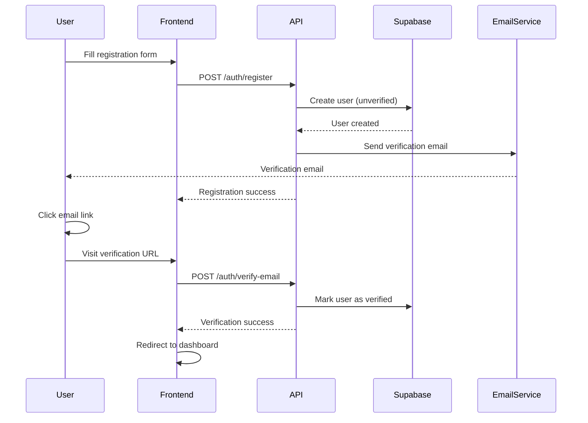
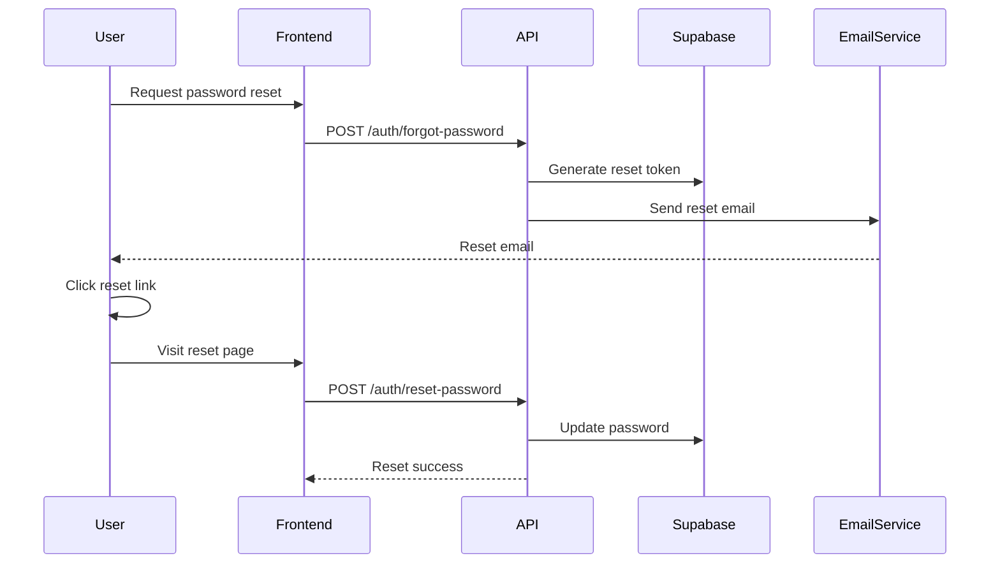

# Authentication & Authorization Documentation

The ESAL Platform uses a comprehensive authentication and authorization system built on top of Supabase Auth with JWT tokens and role-based access control.

## 🔐 Authentication Overview

### Authentication Flow
The platform implements a multi-step authentication process:

1. **User Registration** - Email/password registration with email verification
2. **Email Verification** - Required for account activation
3. **Login** - JWT token generation and user session management
4. **Role Assignment** - Automatic role-based permissions
5. **Token Refresh** - Seamless token renewal

### Supported Authentication Methods
- **Email/Password** - Primary authentication method
- **OAuth Providers** (Future) - Google, LinkedIn, GitHub
- **Magic Links** (Future) - Passwordless authentication

## 🎭 User Roles & Permissions

### Role Hierarchy
```
Super Admin
    ├── Platform Admin
    │   ├── Hub Admin
    │   ├── Investor
    │   └── Innovator
    └── Guest (Unauthenticated)
```

### Role Definitions

#### Innovator
- **Description**: Entrepreneurs and startup founders
- **Permissions**:
  - Submit and manage ideas
  - View matching investors
  - Access innovator portal
  - Update profile and preferences
  - View public opportunities

#### Investor
- **Description**: Angel investors, VCs, and funding organizations
- **Permissions**:
  - Browse startup opportunities
  - Access investment dashboard
  - Manage portfolio
  - View detailed startup information
  - Connect with startups

#### Hub Admin
- **Description**: Accelerator and incubator managers
- **Permissions**:
  - Manage startup batches
  - Oversee mentor assignments
  - Access hub analytics
  - Moderate content
  - Manage events

#### Platform Admin
- **Description**: System administrators
- **Permissions**:
  - Full system access
  - User management
  - System configuration
  - Content moderation
  - Analytics and reporting

#### Super Admin
- **Description**: Technical administrators
- **Permissions**:
  - Database access
  - System maintenance
  - Security configuration
  - Emergency overrides

## 🔑 JWT Token Structure

### Token Payload
```json
{
  "sub": "user-uuid-here",
  "email": "user@example.com",
  "role": "innovator",
  "iat": 1638360000,
  "exp": 1638363600,
  "iss": "esal-platform",
  "aud": "esal-users"
}
```

### Token Lifecycle
- **Access Token**: 1 hour expiration
- **Refresh Token**: 30 days expiration
- **Remember Me**: 90 days expiration

## 🚀 Authentication Implementation

### Frontend Authentication Hook
```typescript
// hooks/useAuth.ts
import { useState, useEffect, createContext, useContext } from 'react';

interface AuthContext {
  user: User | null;
  token: string | null;
  login: (email: string, password: string) => Promise<void>;
  logout: () => void;
  register: (data: RegisterData) => Promise<void>;
  isLoading: boolean;
}

export const useAuth = () => {
  const [user, setUser] = useState<User | null>(null);
  const [token, setToken] = useState<string | null>(null);
  const [isLoading, setIsLoading] = useState(true);

  // Authentication logic here
  
  return { user, token, login, logout, register, isLoading };
};
```

### Protected Route Component
```typescript
// components/ProtectedRoute.tsx
interface ProtectedRouteProps {
  children: React.ReactNode;
  requiredRole?: UserRole;
  fallback?: React.ReactNode;
}

export const ProtectedRoute: React.FC<ProtectedRouteProps> = ({
  children,
  requiredRole,
  fallback
}) => {
  const { user, isLoading } = useAuth();

  if (isLoading) {
    return <LoadingSpinner />;
  }

  if (!user) {
    return <Navigate to="/login" replace />;
  }

  if (requiredRole && !hasRole(user, requiredRole)) {
    return fallback || <UnauthorizedPage />;
  }

  return <>{children}</>;
};
```

### Backend Authentication Middleware
```python
# middleware/auth.py
from fastapi import HTTPException, Depends
from fastapi.security import HTTPBearer
import jwt

security = HTTPBearer()

async def get_current_user(token: str = Depends(security)):
    try:
        payload = jwt.decode(
            token.credentials, 
            settings.JWT_SECRET_KEY, 
            algorithms=[settings.JWT_ALGORITHM]
        )
        user_id = payload.get("sub")
        if not user_id:
            raise HTTPException(status_code=401, detail="Invalid token")
        
        user = await get_user_by_id(user_id)
        if not user:
            raise HTTPException(status_code=401, detail="User not found")
        
        return user
    except jwt.InvalidTokenError:
        raise HTTPException(status_code=401, detail="Invalid token")

def require_role(required_role: str):
    def role_checker(current_user = Depends(get_current_user)):
        if not has_role(current_user, required_role):
            raise HTTPException(status_code=403, detail="Insufficient permissions")
        return current_user
    return role_checker
```

## 📱 Portal-Specific Authentication

### Landing Page
- **Access**: Public
- **Authentication**: Optional
- **Features**: Registration, login, public information

### Innovator Portal
- **Access**: Authenticated innovators only
- **Authentication**: Required
- **Features**: Idea submission, investor matching, progress tracking

### Investor Portal
- **Access**: Authenticated investors only
- **Authentication**: Required
- **Features**: Deal flow, portfolio management, startup discovery

### Hub Portal
- **Access**: Authenticated hub admins only
- **Authentication**: Required
- **Features**: Batch management, mentor coordination, analytics

### Admin Portal
- **Access**: Platform admins and super admins only
- **Authentication**: Required + elevated permissions
- **Features**: User management, system configuration, analytics

## 🔒 Security Measures

### Password Security
- **Minimum Length**: 8 characters
- **Complexity**: Must include letters and numbers
- **Hashing**: bcrypt with salt rounds
- **Reset**: Secure email-based password reset

### Session Security
- **HTTPS Only**: All authentication over SSL
- **CSRF Protection**: Cross-site request forgery prevention
- **XSS Protection**: Content Security Policy headers
- **Rate Limiting**: Login attempt limitations

### Token Security
- **Secure Storage**: HttpOnly cookies for sensitive tokens
- **Token Rotation**: Automatic refresh token rotation
- **Revocation**: Ability to revoke tokens
- **Encryption**: Token payload encryption

## 📧 Email Verification Flow

### Registration Process


### Email Template
```html
<!DOCTYPE html>
<html>
<head>
    <title>Verify Your ESAL Platform Account</title>
</head>
<body>
    <div style="max-width: 600px; margin: 0 auto; padding: 20px;">
        <h1>Welcome to ESAL Platform!</h1>
        <p>Thank you for registering. Please verify your email address by clicking the button below:</p>
        
        <a href="{{verification_url}}" 
           style="background: #007bff; color: white; padding: 12px 24px; text-decoration: none; border-radius: 4px; display: inline-block;">
            Verify Email Address
        </a>
        
        <p>This link will expire in 24 hours.</p>
        <p>If you didn't create this account, please ignore this email.</p>
    </div>
</body>
</html>
```

## 🔄 Password Reset Flow

### Reset Process


## 🛡️ Permission Checks

### Frontend Permission Hooks
```typescript
// hooks/usePermissions.ts
export const usePermissions = () => {
  const { user } = useAuth();

  const hasPermission = (permission: string): boolean => {
    if (!user) return false;
    
    const rolePermissions = {
      innovator: ['submit_ideas', 'view_opportunities'],
      investor: ['view_startups', 'manage_portfolio'],
      hub_admin: ['manage_batches', 'view_analytics'],
      admin: ['manage_users', 'system_config']
    };

    return rolePermissions[user.role]?.includes(permission) || false;
  };

  const hasRole = (role: string): boolean => {
    return user?.role === role;
  };

  const hasAnyRole = (roles: string[]): boolean => {
    return roles.includes(user?.role || '');
  };

  return { hasPermission, hasRole, hasAnyRole };
};
```

### Backend Permission Decorators
```python
# decorators/permissions.py
from functools import wraps
from fastapi import HTTPException

def require_permission(permission: str):
    def decorator(func):
        @wraps(func)
        async def wrapper(*args, **kwargs):
            current_user = kwargs.get('current_user')
            if not has_permission(current_user, permission):
                raise HTTPException(status_code=403, detail="Insufficient permissions")
            return await func(*args, **kwargs)
        return wrapper
    return decorator

def require_any_role(*roles):
    def decorator(func):
        @wraps(func)
        async def wrapper(*args, **kwargs):
            current_user = kwargs.get('current_user')
            if current_user.role not in roles:
                raise HTTPException(status_code=403, detail="Insufficient permissions")
            return await func(*args, **kwargs)
        return wrapper
    return decorator
```

## 🧪 Testing Authentication

### Unit Tests
```python
# tests/test_auth.py
import pytest
from app.auth import create_access_token, verify_token

class TestAuthentication:
    def test_create_token(self):
        user_data = {"sub": "test-user", "role": "innovator"}
        token = create_access_token(user_data)
        assert token is not None

    def test_verify_valid_token(self):
        user_data = {"sub": "test-user", "role": "innovator"}
        token = create_access_token(user_data)
        payload = verify_token(token)
        assert payload["sub"] == "test-user"

    def test_verify_expired_token(self):
        # Test expired token handling
        pass

    def test_invalid_token(self):
        with pytest.raises(Exception):
            verify_token("invalid-token")
```

### Integration Tests
```python
# tests/integration/test_auth_endpoints.py
import pytest
from httpx import AsyncClient

class TestAuthEndpoints:
    async def test_register_user(self, client: AsyncClient):
        response = await client.post("/api/v1/auth/register", json={
            "email": "test@example.com",
            "full_name": "Test User",
            "password": "testpass123",
            "role": "innovator"
        })
        assert response.status_code == 201

    async def test_login_user(self, client: AsyncClient):
        # Register first
        await client.post("/api/v1/auth/register", json={
            "email": "test@example.com",
            "full_name": "Test User", 
            "password": "testpass123",
            "role": "innovator"
        })

        # Then login
        response = await client.post("/api/v1/auth/login", json={
            "email": "test@example.com",
            "password": "testpass123"
        })
        assert response.status_code == 200
        assert "access_token" in response.json()
```

## 🔧 Configuration

### Environment Variables
```bash
# JWT Configuration
JWT_SECRET_KEY=your-super-secret-key
JWT_ALGORITHM=HS256
JWT_EXPIRATION_TIME=3600

# Supabase Auth
SUPABASE_URL=https://your-project.supabase.co
SUPABASE_ANON_KEY=your-anon-key
SUPABASE_SERVICE_ROLE_KEY=your-service-role-key

# Email Configuration
SMTP_HOST=smtp.gmail.com
SMTP_PORT=587
SMTP_USER=your-email@gmail.com
SMTP_PASSWORD=your-app-password
```

### Frontend Configuration
```typescript
// config/auth.ts
export const authConfig = {
  tokenKey: 'esal_access_token',
  refreshTokenKey: 'esal_refresh_token',
  userKey: 'esal_user',
  loginUrl: '/login',
  dashboardUrl: '/dashboard',
  tokenRefreshThreshold: 5 * 60 * 1000, // 5 minutes
};
```

## 📚 Troubleshooting

### Common Issues

#### "Invalid token" errors
- Check token expiration
- Verify JWT secret key
- Ensure proper token format

#### Email verification not working
- Check SMTP configuration
- Verify email template
- Check spam folder

#### Role permission errors
- Verify user role assignment
- Check permission definitions
- Review role hierarchy

#### Session timeout issues
- Check token expiration settings
- Implement proper refresh logic
- Handle network interruptions

### Debug Commands
```bash
# Check user authentication
curl -H "Authorization: Bearer $TOKEN" http://localhost:8000/api/v1/users/me

# Test email sending
python test_email_smtp.py

# Verify JWT token
python -c "import jwt; print(jwt.decode('$TOKEN', verify=False))"
```

---

*For specific implementation details, refer to the code in `/apps/api/app/auth/` and `/apps/*/src/auth/`*
